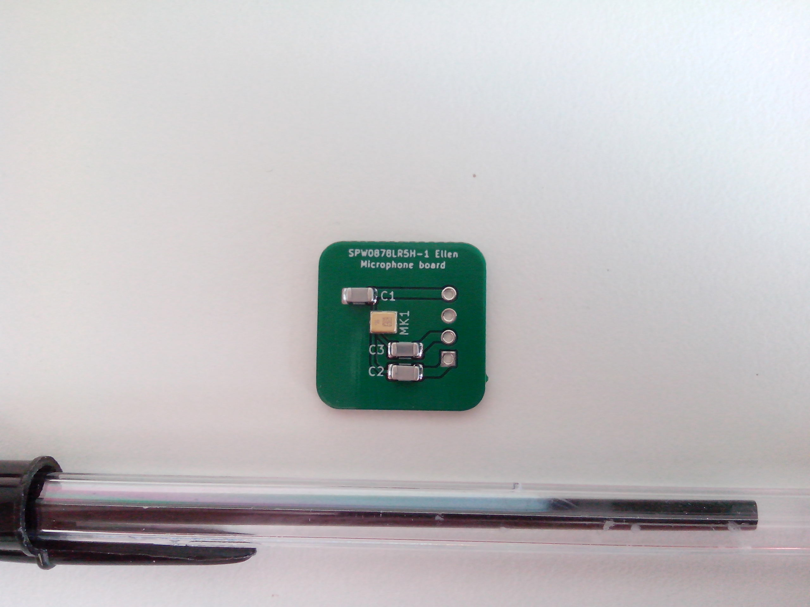
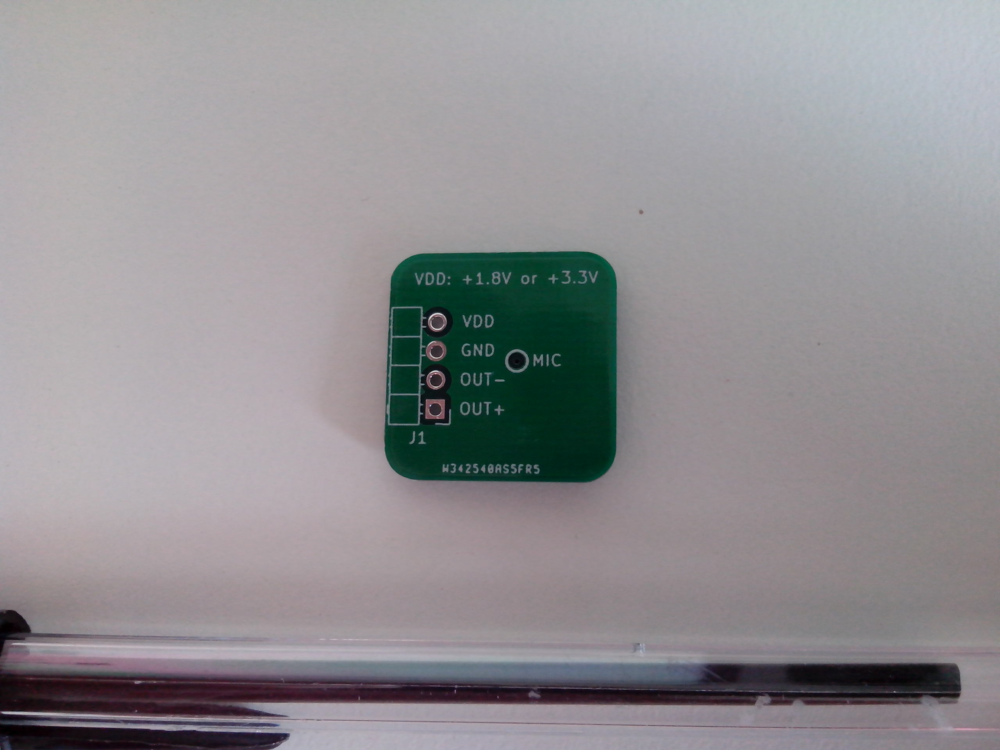

# Microphone breakout board

A simple breakout board for the Knowles SPW0878LR5H-1 Ellen analog microphone.

## PCB production files generation

Use the `Makefile` located in the `Hardware` directory to panelize the board or to generate the production files.

## Photo gallery

